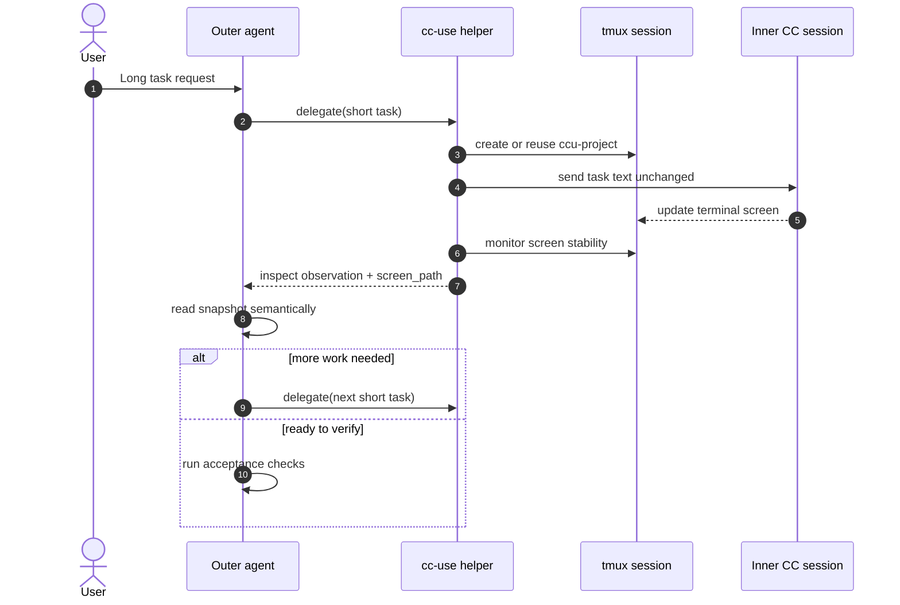
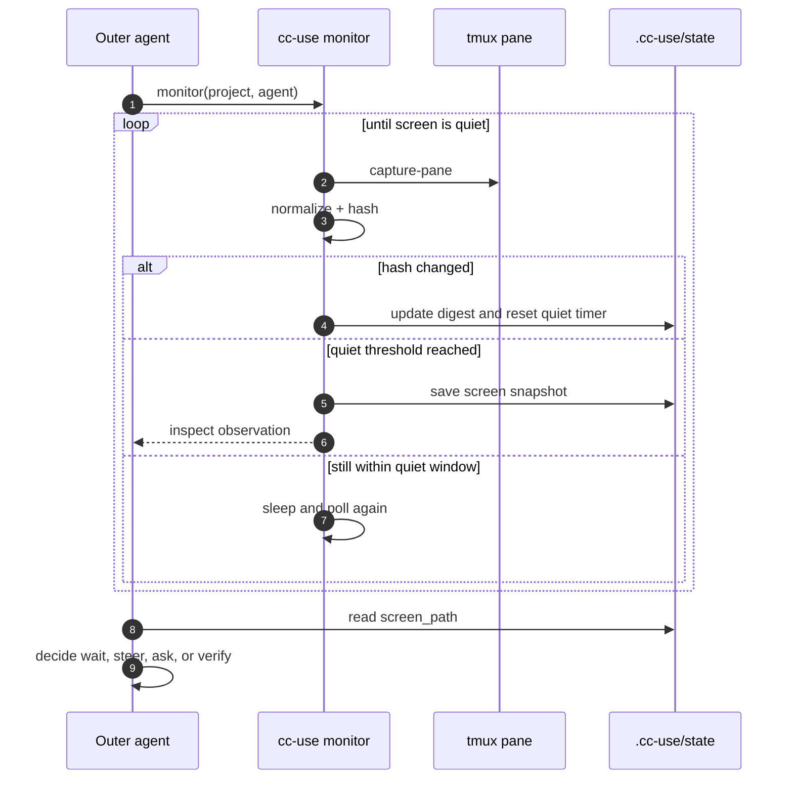
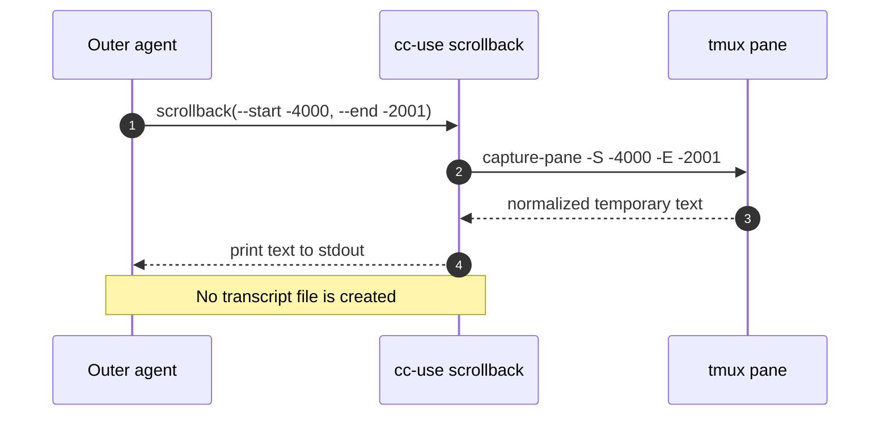

# cc-use

cc-use is a skill for delegating long-running coding work to an inner CC session
running in tmux. The user-facing interface is the skill, not the CLI.

The outer agent stays in the main interactive TUI, starts or reuses an inner
CC session, sends short task requests there, monitors by screen stability, and
performs final acceptance checks itself.

Here, **CC** means a coding command-line agent. Depending on the host and local
configuration, that can mean Claude Code, Codex CLI, or another compatible
coding CLI. The important part is the supervision pattern: one outer interactive
agent breaks the work into short requests and uses an inner terminal session for
focused execution.

## Installation

Install using [npx skills](https://skills.sh).

### Install to all supported agents

```bash
# Global: available in all projects, all supported agents
npx skills add zc277584121/cc-use --all -g

# Project-level: current project only, all supported agents
npx skills add zc277584121/cc-use --all
```

### Install to a specific agent

```bash
npx skills add zc277584121/cc-use -a claude-code -g
npx skills add zc277584121/cc-use -a codex -g
```

Other supported agents include `cursor`, `windsurf`, `github-copilot`, `cline`,
`roo`, `gemini-cli`, `goose`, `kilo`, `augment`, `opencode`, and more. See
[skills.sh](https://skills.sh) for the current list.

Without `-g`, skills are installed into the current project. With `-g`, they are
installed globally and are available across projects.

## Updating

```bash
# Check for updates
npx skills check

# Update globally installed skills
npx skills update
```

To update a project-level install, re-run the `npx skills add` command.

## How Users Invoke It

Use cc-use from an interactive coding-agent session by mentioning the skill and
the task in natural language.

### Codex CLI

In Codex CLI, first confirm the skill is visible:

```text
/skills
```

Then invoke it from the chat:

```text
$cc-use Fix the flaky test in this repo. Let the inner agent investigate and
implement the fix, then verify it end-to-end.
```

or:

```text
Use cc-use to add a small CLI command to this project. Let the inner agent do
the implementation and come back when it has a result to verify.
```

The outer agent loads the `cc-use` skill instructions and uses the helper for
delegation, monitoring, and verification workflow support.

### Claude Code

In Claude Code, confirm the skill is available:

```text
/skills
```

Then ask for it explicitly:

```text
Use the cc-use skill to refactor the database module. Delegate the implementation
to an inner session and keep me updated only when there is something to review.
```

or:

```text
Use cc-use for this long task: implement password reset, run the tests, and let
me know when the outer verification should start.
```

The exact trigger syntax may differ by host, but the reliable pattern is to name
the skill directly: `cc-use`, `$cc-use`, or `Use the cc-use skill...`.

## What The Skill Does

When invoked, the outer agent should:

1. Start or reuse an inner CC session in tmux for the same agent family as the
   outer session.
2. Break the user's request into short, focused inner requests.
3. Send each inner request as written, without adding wrapper instructions or
   rewriting it.
4. Avoid reading the inner screen while it is actively changing.
5. If the screen is quiet past the current expectation, inspect one screen
   snapshot and decide when to check again.
6. Steer the inner session with another short request only when needed.
7. Run final acceptance checks from the outer session.

This keeps the outer context small while preserving outer control over
decomposition, review, and acceptance.

```text
User request
    |
    v
Outer agent
    |  short task text
    v
cc-use helper  --------------------+
    |                              |
    | tmux send-keys               | tmux capture-pane
    v                              |
Inner CC session in tmux            |
    |                              |
    +-- implementation work --------+
                                   |
                                   v
                           screen snapshot
                                   |
                                   v
                         Outer semantic review
                                   |
                                   v
                         Outer acceptance checks
```



The tmux session and the interactive inner TUI are the source of truth. Session
names use the compact `ccu-<project-name>` form, for example `ccu-my-project`.
If the session already exists, cc-use reuses it; otherwise it creates a new
persistent TUI.

The inner session is intentionally persistent. The outer agent should leave it
running after routine task completion so later work can continue in the same
project context, even across separate outer conversations or later days. Close
it only when the user explicitly asks, or when the session is broken and a fresh
one is required.

## Monitoring Model

cc-use does not try to parse a specific TUI state. It compares normalized tmux
screen snapshots:

- If the screen changes, the inner agent is considered active and the outer agent
  stays out of the way.
- If the screen stays unchanged past the current quiet threshold, cc-use captures
  one screen snapshot and emits an observation.
- Each observation is a neutral `inspect` event. The helper does not try to
  classify stable screens as waiting, blocked, or complete. The outer agent reads
  the saved snapshot and decides whether to wait, inspect further, steer the
  inner session, or start verification.

## How It Works

cc-use treats the tmux pane as the only shared surface between the outer and
inner agents. The outer agent does not consume the inner agent's file reads,
tool calls, or command output directly. It only observes the terminal screen at
controlled moments.

The loop is:

1. Capture the current tmux screen text.
2. Normalize it and compute a hash.
3. If the hash changed, mark the inner session as active and do nothing else.
4. If the hash stays unchanged long enough, capture one screen snapshot for
   inspection.
5. Produce a neutral observation pointing at that snapshot.

This keeps the outer context small while preserving enough information to make
human-like supervision decisions.

```text
capture screen
      |
      v
normalize + hash
      |
      +-- hash changed --------------------+
      |                                    |
      v                                    |
reset quiet timer                          |
      |                                    |
      +------------------------------------+
      |
      v
hash unchanged long enough
      |
      v
save screen snapshot
      |
      v
emit inspect observation
      |
      v
outer agent reads screen_path and decides
```



### What The Outer Agent Sees

The outer agent sees a normal terminal screen from the inner CC session. Typical
examples:

```text
• Running pytest
  └ collected 42 items
```

The screen is changing. cc-use treats this as active work. The outer agent does
not inspect every line; it waits.

```text
• Running npm test
```

The screen may stop changing while a long command is still running. When the
quiet threshold is reached, cc-use emits an `inspect` observation. The outer
agent reads the snapshot and may decide to wait longer, for example 60-180
seconds, because test/build commands can be quiet for a while.

```text
› Create result.txt with hello.

• DONE
```

The screen is quiet and appears to show a completed response. The outer agent can
inspect the result and start acceptance verification.

```text
Allow this command?
```

The screen is quiet because the inner session is blocked on input. The outer
agent should intervene, ask the user if needed, or send an appropriate key.

```text
network request timed out
```

The screen is quiet after an error. The outer agent can send a correction or ask
the inner agent to retry with a different approach.

### Observations

An observation is a structured event written to `.cc-use/state/` and printed to
the outer agent. It includes:

- how long the screen has been quiet;
- the current screen hash;
- the saved screen snapshot path;
- a neutral `inspect` action.

Example:

```json
{
  "event": "observation",
  "session": "ccu-my-project",
  "silence_seconds": 8.005,
  "screen_path": ".cc-use/state/ccu-my-project/screens/ccu-my-project-0001.txt",
  "decision": {
    "action": "inspect",
    "next_check_after_seconds": 0,
    "reason": "The screen is stable; inspect screen_path semantically before deciding whether to wait, steer, or verify.",
    "confidence": 1.0
  }
}
```

`inspect` means only that the screen has been stable long enough to look at it.
The outer agent must inspect `screen_path` semantically before deciding whether
to wait, steer, ask the user, continue delegation, or run acceptance checks.

If the saved snapshot does not include enough context, read recent tmux
scrollback on demand:

```bash
skills/cc-use/scripts/cc-use scrollback --project "$PWD" --agent codex --lines 2000
```

This command prints recent scrollback for temporary inspection. To page through
older output without rereading the same lines, specify an explicit tmux line
range:

```bash
skills/cc-use/scripts/cc-use scrollback --project "$PWD" --agent codex --start -4000 --end -2001
skills/cc-use/scripts/cc-use scrollback --project "$PWD" --agent codex --start -2000 --end -
```

Negative numbers refer to scrollback history, `0` is the first visible line, and
`-` means the end of the visible pane. cc-use does not persist long-running
transcript logs by default.



### Situation To Action

| tmux screen situation | cc-use behavior | outer agent action |
| --- | --- | --- |
| Screen keeps changing | Resets quiet timer | Do not inspect; let inner work |
| Quiet after a short task | Emits `inspect` | Verify files, commands, or UI from outside if the snapshot is complete |
| Quiet while tests/build likely run | Emits `inspect` | Call `monitor` later if the snapshot shows work still running |
| Quiet on permission/input prompt | Emits `inspect` | Send key, steer, or ask user |
| Quiet after visible error | Emits `inspect` | Send corrective instruction |
| Session disappeared | Emits `session_unavailable` | Decide whether to restart or report failure |

The important distinction is that cc-use is not an idle detector. It is an
adaptive observation scheduler: it decides when the outer agent should look, not
what the stable screen means.

## Local Development Notes

The skill file should be installed where the host agent loads skills from.

On this machine, the installed skill file is:

```text
/Users/zilliz/.agents/skills/cc-use/SKILL.md
```

The source copy in this repository is:

```text
skills/cc-use/SKILL.md
```

After updating the skill file, restart the interactive agent or reload skills if
the host supports it.

## Developer Debugging

The shell helper exists for the skill and for maintainers. It is not the normal
user interface, and it does not require `uv` or a Python package install.

Project-level commands used by the skill:

```bash
skills/cc-use/scripts/cc-use delegate "TASK_TEXT" --project "$PWD" --agent codex
skills/cc-use/scripts/cc-use monitor --project "$PWD" --agent codex
skills/cc-use/scripts/cc-use project-status --project "$PWD" --agent codex
skills/cc-use/scripts/cc-use scrollback --project "$PWD" --agent codex --lines 2000
skills/cc-use/scripts/cc-use scrollback --project "$PWD" --agent codex --start -4000 --end -2001
```

`TASK_TEXT` is sent to the inner session exactly as provided. The helper does
not add role text, policy text, or task wrappers; the outer session is
responsible for making each request small and concrete.

For Codex, no profile is passed by default. If the user explicitly asks for an
inner Codex profile when the session is first created, pass it once:

```bash
skills/cc-use/scripts/cc-use delegate "TASK_TEXT" --project "$PWD" --agent codex --profile zilliz
```

After the inner TUI exists, future requests reuse the same tmux session and do
not need the profile again. Claude Code uses its default configuration and does
not accept `--profile`.

Low-level debugging commands:

```bash
skills/cc-use/scripts/cc-use list
skills/cc-use/scripts/cc-use snapshot <session>
skills/cc-use/scripts/cc-use kill <session>
```

`kill` is for explicit cleanup or recovery. It is not part of the normal
completion flow.

## Local Verification

Run the lightweight regression tests from the repository root:

```bash
bash tests/cc-use-regression.sh
```

The tests use temporary directories and `PATH` stubs for `tmux`, so they do not
start a real inner agent session or require external dependencies.

## Runtime State

For each delegated project, cc-use writes observation state under:

```text
.cc-use/state/<session-name>/
```

Important files:

- `watch.json`: current watch schedule and latest observation.
- `watch.observations.jsonl`: observation history.
- `screens/`: normalized screen snapshots captured during observations.

cc-use does not write persistent transcript logs. Use `scrollback` for temporary
tmux history inspection when a saved screen snapshot is not enough.
