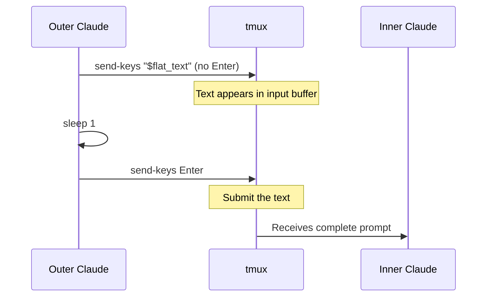
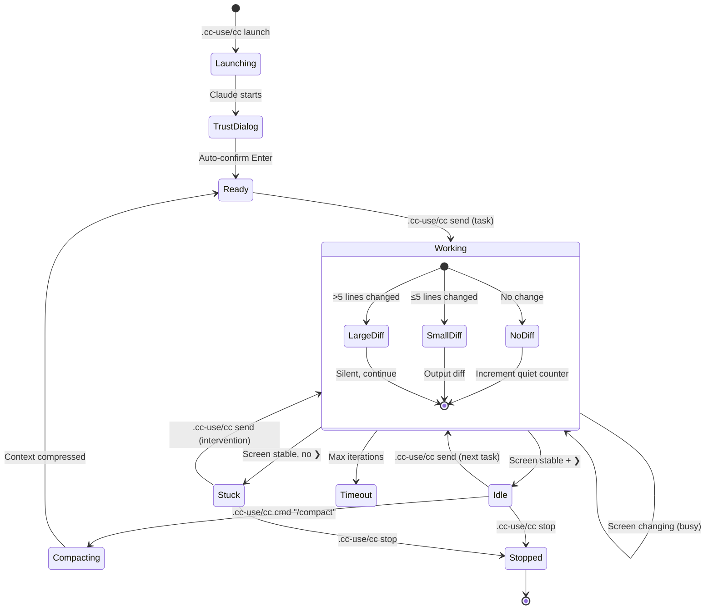

# Architecture & Design Philosophy

## Core Principle: Context Is the Bottleneck

A single Claude Code session has a finite context window. Every file read, code edit, test output, and debugging iteration consumes tokens. When the context fills up, Claude loses track of earlier work, and `/compact` or restart becomes necessary.

cc-use solves this by **splitting cognition across two layers**: a supervisor that thinks in summaries, and a worker that thinks in code.

```
┌──────────────────────────────────────────────────────────┐
│                    Outer Claude (You)                     │
│                                                          │
│  Context grows at: ~20-50 tokens per monitoring cycle    │
│                                                          │
│  ┌─────────────┐  ┌──────────────┐  ┌────────────────┐  │
│  │   Planning   │  │  Monitoring   │  │   Acceptance   │  │
│  │  & Steering  │  │  (screen-diff)│  │   Testing      │  │
│  └─────────────┘  └──────┬───────┘  └────────────────┘  │
└──────────────────────────┼───────────────────────────────┘
                           │ tmux (send-keys / capture-pane)
┌──────────────────────────▼───────────────────────────────┐
│                    Inner Claude (Worker)                  │
│                                                          │
│  Context grows at: full speed (every tool call)          │
│  Can be restarted with fresh context at any time         │
│                                                          │
│  ┌────────┐ ┌────────┐ ┌────────┐ ┌──────────────────┐  │
│  │  Read  │ │  Edit  │ │  Bash  │ │  Debug & Iterate │  │
│  └────────┘ └────────┘ └────────┘ └──────────────────┘  │
└──────────────────────────────────────────────────────────┘
```

**Key insight**: The inner Claude's context can be burned through and restarted. The outer Claude's context must be preserved — it holds the big picture.

---

## Monitoring: Screen-Diff

The outer Claude monitors the inner Claude by comparing tmux screen snapshots. Instead of asking "is it done?", it asks "what changed?"

Every 10 seconds, the monitor captures the current screen and diffs it against the previous snapshot:

- **Large change (>5 new lines)**: Inner Claude is busy producing output — stay silent, save the new screen
- **Small change (≤5 new lines)**: Output only the new lines to the outer Claude — incremental, no repeated content
- **No change + ❯ prompt visible**: Inner Claude is done — declare IDLE
- **No change, no ❯ prompt**: Inner Claude might be thinking or stuck — wait longer before declaring STUCK


### Three exit states

| State | Condition | Meaning |
|-------|-----------|---------|
| **IDLE** | No screen change × 3 + ❯ visible | Inner Claude finished, waiting for input |
| **STUCK** | No screen change × 6, no ❯ | Might be waiting for permission, hanging, or other issue |
| **TIMEOUT** | Max iterations reached | Task taking too long, needs intervention |

Requiring both **stable screen** AND **❯ prompt** for IDLE prevents false detection when inner Claude is thinking between tool calls (screen doesn't change but Claude hasn't finished).

---

## Progressive Disclosure: 4-Tier Reading

### Design philosophy: simulate a human looking at a terminal

When a human checks on a long-running process, they don't read the entire terminal history. They:

1. **Glance** at the bottom — "is it done?"
2. **Skim** the last few lines — "what did it do?"
3. **Scroll up** if needed — "what happened before that?"
4. **Check logs** if really confused — "give me everything"

cc-use replicates this with 4 tiers, expanding only when needed:


### Tier details

**Tier 0 — Status check (automatic)**

Provided by `.cc-use/cc watch` on exit. Finds the last `●` marker in the screen (which starts Claude's response) and returns from there, with TUI noise filtered out (spinners, timers, decoration lines). Answers: "Did it finish? What did it conclude?"

**Tier 1 — Quick summary**

`.cc-use/cc glance "$session" 10` — 10 lines. Usually captures inner Claude's completion summary. Answers: "What did it accomplish?"

**Tier 2 — Scroll up page by page**

`.cc-use/cc scroll "$session" <page>` — 30 lines per page with **zero overlap**:

```
┌──────────────────────────────────┐
│  .cc-use/cc scroll  page 2      │ ← older output
│   (lines 61-90)                  │
├──────────────────────────────────┤
│  .cc-use/cc scroll  page 1      │ ← middle
│   (lines 31-60)                  │
├──────────────────────────────────┤
│  .cc-use/cc scroll  page 0      │ ← most recent
│   (lines 1-30)                   │
└──────────────────────────────────┘
            Bottom of screen
```

Each page adds only new information — no repeated content across pages.

**Tier 3 — Full conversation transcript**

Two commands for JSONL transcript parsing from `~/.claude/projects/`:

- `.cc-use/cc read_conversation "$project_dir" [N]` — extracts last N complete assistant messages (all text blocks joined per message, separated by `--- MESSAGE ---`)
- `.cc-use/cc read_tools "$project_dir" [N]` — lightweight overview: shows tool calls + text summary (first 80 chars) for last N messages. Use to quickly understand what inner Claude did without reading full responses.

### Context efficiency

| Scenario | Without tiers | With tiers |
|----------|--------------|------------|
| Task completed successfully | 60 tokens (40-line glance) | 5 tokens (Tier 0) |
| Need to understand what happened | 60 tokens (same glance) | 15 tokens (Tier 1) |
| Need to debug an error | 60 tokens (often not enough) | 45-90 tokens (Tier 2) |
| 5 monitoring cycles | 300 tokens (mostly repeated) | ~50 tokens (no repeats) |

---

## Prompt Delivery: Two-Step Send

Claude Code collapses pasted text longer than ~700 characters into `[Pasted text ...]` and does not auto-submit it. To reliably deliver prompts of any length, cc-use sends text and Enter as two separate tmux calls:



Prompts are flattened to a single line (`tr '\n' ' '`) before sending, because multi-line input triggers paste bracketing which interferes with submission.

| Text length | Single send-keys+Enter | Two-step (text, then Enter) |
|-------------|----------------------|---------------------------|
| < 500 chars | Works | Works |
| 500-700 chars | Unreliable | Works |
| > 700 chars | Fails | Works |

---

## tmux capture-pane Coordinates

`capture-pane -S` uses tmux's line numbering where **negative numbers go into the scrollback buffer**, not from the bottom of the visible area:

```
     scrollback buffer
     ─────────────────
-3 → │  line A        │  ← "-S -3" starts HERE (in scrollback)
-2 → │  line B        │
-1 → │  line C        │
     ═════════════════
      visible area (50 rows)
     ─────────────────
 0 → │  line D        │  ← first visible line
 1 → │  line E        │
     │  ...           │
49 → │  line Z        │  ← last visible line
     ─────────────────
```

`-S -3` captures 3 scrollback lines + 50 visible lines = 53 lines, **not** "last 3 lines." To get the last N lines:

```bash
tmux capture-pane -t "$session" -p | tail -N
```

All cc-use reading functions (`glance`, `scroll`, `is_idle`, `wait_shell`) use this `| tail` pattern.

---

## Session Lifecycle



---

## File Structure

```
my-project/
├── .cc-use/
│   ├── cc                            # Dispatcher symlink (created during init)
│   └── state/
│       ├── session-info.json      # Session config (name, perms, project path)
│       ├── last-screen.txt        # Previous tmux snapshot (for diffing)
│       └── env-changes.md         # System-level change log
│
├── CLAUDE.md                      # Inner Claude's instructions (project-specific)
└── (project files...)

~/.claude/projects/<mangled-path>/
└── *.jsonl                        # Inner Claude's conversation transcripts
                                   # (used by Tier 3 reading)
```

---

## Design Decisions

| Decision | Rationale |
|----------|-----------|
| Screen-diff monitoring | Provides incremental updates without repeated content |
| ❯ prompt required for IDLE | Screen stability alone isn't enough — Claude pauses between tool calls |
| 4-tier progressive reading | Most cycles only need 5-15 tokens; expand on demand |
| No-overlap scroll pages | Simulates human Page Up; each page adds only new info |
| Two-step prompt send | Single send-keys+Enter fails for text >700 chars |
| `capture-pane \| tail -N` | tmux `-S -N` enters scrollback, not "last N lines" |
| No pipe-pane logging | Raw terminal output contains unreadable ANSI escape codes |
| Auto-confirm trust dialog | `--dangerously-skip-permissions` doesn't skip the initial trust prompt |
