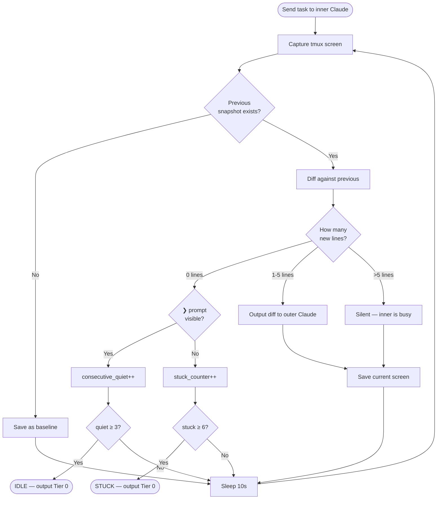
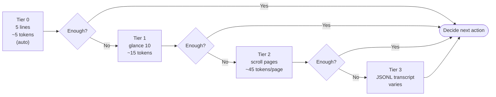
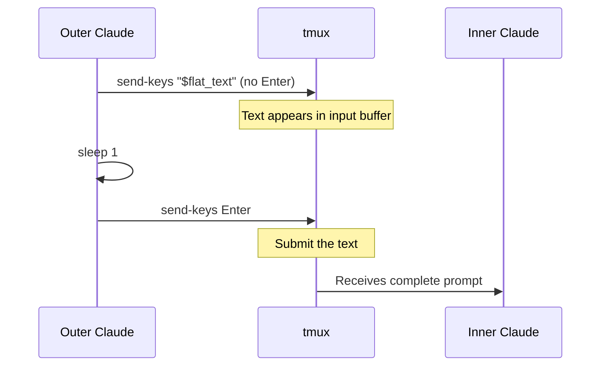
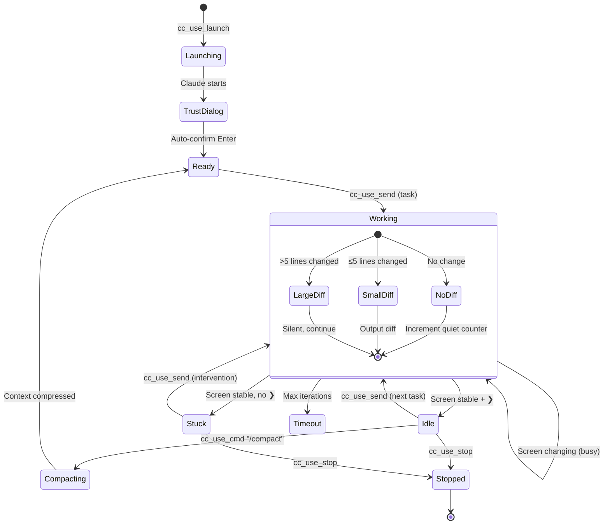

# Architecture & Design Philosophy

## Core Principle: Context Is the Bottleneck

A single Claude Code session has a finite context window. Every file read, code edit, test output, and debugging iteration consumes tokens. When the context fills up, Claude loses track of earlier work, and `/compact` or restart becomes necessary.

cc-use solves this by **splitting cognition across two layers**: a supervisor that thinks in summaries, and a worker that thinks in code.

```
┌──────────────────────────────────────────────────────────┐
│                    Outer Claude (You)                     │
│                                                          │
│  Context grows at: ~20-50 tokens per monitoring cycle    │
│                                                          │
│  ┌─────────────┐  ┌──────────────┐  ┌────────────────┐  │
│  │   Planning   │  │  Monitoring   │  │   Acceptance   │  │
│  │  & Steering  │  │  (screen-diff)│  │   Testing      │  │
│  └─────────────┘  └──────┬───────┘  └────────────────┘  │
└──────────────────────────┼───────────────────────────────┘
                           │ tmux (send-keys / capture-pane)
┌──────────────────────────▼───────────────────────────────┐
│                    Inner Claude (Worker)                  │
│                                                          │
│  Context grows at: full speed (every tool call)          │
│  Can be restarted with fresh context at any time         │
│                                                          │
│  ┌────────┐ ┌────────┐ ┌────────┐ ┌──────────────────┐  │
│  │  Read  │ │  Edit  │ │  Bash  │ │  Debug & Iterate │  │
│  └────────┘ └────────┘ └────────┘ └──────────────────┘  │
└──────────────────────────────────────────────────────────┘
```

**Key insight**: The inner Claude's context can be burned through and restarted. The outer Claude's context must be preserved — it holds the big picture.

---

## Monitoring: Screen-Diff

### Why not polling?

The naive approach is to poll `tmux capture-pane` every N seconds and check for the `❯` prompt. Problems:

1. **Repeated content**: Each glance captures 40+ lines, most of which were already seen
2. **All-or-nothing**: You either see everything or nothing — no incremental updates
3. **Context waste**: Same lines enter outer context again and again

### The screen-diff approach

Instead of asking "is it done?", we ask "what changed?"



### Three exit states

| State | Condition | Meaning |
|-------|-----------|---------|
| **IDLE** | No screen change × 3 + ❯ visible | Inner Claude finished, waiting for input |
| **STUCK** | No screen change × 6, no ❯ | Might be waiting for permission, hanging, or other issue |
| **TIMEOUT** | Max iterations reached | Task taking too long, needs intervention |

### Why check ❯ on quiet?

Without the ❯ check, we had **false QUIET detection**: inner Claude pauses for 20+ seconds between tool calls (thinking, planning next step), the screen doesn't change, and the monitor falsely declares "done."

The fix: screen stability alone is not enough. We require both **stable screen** AND **❯ prompt** to declare IDLE. If the screen is stable but no ❯, inner Claude might be thinking — we wait longer before declaring STUCK.

---

## Progressive Disclosure: 4-Tier Reading

### Design philosophy: simulate a human looking at a terminal

When a human checks on a long-running process, they don't read the entire terminal history. They:

1. **Glance** at the bottom — "is it done?"
2. **Skim** the last few lines — "what did it do?"
3. **Scroll up** if needed — "what happened before that?"
4. **Check logs** if really confused — "give me everything"

cc-use replicates this behavior with 4 tiers:



### Tier details

**Tier 0 — Status check (automatic)**

Provided by `cc_use_watch` on exit. Shows the last 5 lines of the tmux pane — typically the `❯` prompt and a one-line summary from inner Claude. Enough to answer: "Did it finish? Did it succeed?"

**Tier 1 — Quick summary**

`cc_use_glance "$session" 10` — shows 10 lines. Usually captures inner Claude's completion summary (e.g., "Created 3 files, all tests pass"). Enough to answer: "What did it accomplish?"

**Tier 2 — Scroll up page by page**

`cc_use_scroll "$session" <page>` — each page is 30 lines with **zero overlap** between pages. Simulates pressing Page Up in a terminal:

```
┌─────────────────────────┐
│  cc_use_scroll  page 2  │ ← older output
│   (lines 61-90)         │
├─────────────────────────┤
│  cc_use_scroll  page 1  │ ← middle
│   (lines 31-60)         │
├─────────────────────────┤
│  cc_use_scroll  page 0  │ ← most recent
│   (lines 1-30)          │
└─────────────────────────┘
         Bottom of screen
```

Key property: **no repeated content** across pages. Each page adds only new information to the outer context.

**Tier 3 — Full conversation transcript**

`cc_use_read_conversation "$project_dir"` — parses the inner Claude's JSONL transcript file from `~/.claude/projects/`. Extracts assistant text messages. Use when you need inner Claude's complete reasoning, not just what's visible on screen.

### Why this matters for context efficiency

Without progressive disclosure, every monitoring cycle adds ~60 tokens (40-line glance). With it:

| Scenario | Old approach | Progressive |
|----------|-------------|-------------|
| Inner completed successfully | 60 tokens (40-line glance) | 5 tokens (Tier 0 auto) |
| Need to understand what happened | 60 tokens (same glance) | 15 tokens (Tier 1) |
| Need to debug an error | 60 tokens (often not enough) | 45-90 tokens (Tier 2, targeted) |
| Over 5 monitoring cycles | 300 tokens (mostly repeated) | ~50 tokens (no repeats) |

---

## Prompt Delivery: Two-Step Send

### The problem

Claude Code's terminal collapses pasted text longer than ~700 characters into `[Pasted text ...]` and does **not** auto-submit it. A single `tmux send-keys "long text" Enter` fails silently for long prompts.

### The solution



Prompts are also flattened to a single line (`tr '\n' ' '`) before sending, because multi-line input triggers paste bracketing which interferes with submission.

| Text length | Single send-keys+Enter | Two-step (text, then Enter) |
|-------------|----------------------|---------------------------|
| < 500 chars | ✅ Works | ✅ Works |
| 500-700 chars | ⚠️ Unreliable | ✅ Works |
| > 700 chars | ❌ Collapsed, not submitted | ✅ Works |

---

## tmux Coordinate System

A critical implementation detail that caused bugs during development.

### How `capture-pane -S` actually works

```
     scrollback buffer
     ─────────────────
-3 → │  line A        │  ← "-S -3" starts HERE (3 lines into scrollback)
-2 → │  line B        │
-1 → │  line C        │
     ═════════════════
      visible area
     ─────────────────
 0 → │  line D        │  ← first visible line
 1 → │  line E        │
 2 → │  line F        │
     │  ...           │
49 → │  line Z        │  ← last visible line (50-row pane)
     ─────────────────
```

**`-S -3` does NOT mean "last 3 lines"**. It means "start from 3 lines above the visible area (in scrollback), capture everything down to the bottom." That's 3 + 50 = 53 lines.

**Correct way to get the last N lines:**

```bash
# ✅ Correct
tmux capture-pane -t "$session" -p | tail -N

# ❌ Wrong — captures scrollback + full visible area
tmux capture-pane -t "$session" -p -S -N
```

This affects all reading functions: `glance`, `scroll`, `is_idle`, `wait_shell`.

---

## Session Lifecycle



---

## File Structure

```
my-project/
├── .cc-use/
│   └── state/
│       ├── session-info.json      # Session config (name, perms, project path)
│       ├── last-screen.txt        # Previous tmux snapshot (for diffing)
│       └── env-changes.md         # System-level change log
│
├── CLAUDE.md                      # Inner Claude's instructions
└── (project files...)

~/.claude/projects/<mangled-path>/
└── *.jsonl                        # Inner Claude's conversation transcripts
                                   # (used by Tier 3 reading)
```

---

## Design Decisions Summary

| Decision | Alternative considered | Why we chose this |
|----------|----------------------|-------------------|
| Screen-diff over polling | Poll for ❯ every 5s | Avoids repeated content, provides incremental updates |
| ❯ check on quiet | Screen stability alone | Prevents false QUIET when inner Claude is thinking |
| 4-tier progressive reading | Always capture 40 lines | Minimizes context — most cycles only need Tier 0 |
| No-overlap scroll pages | Fixed-size glance | Simulates human scrolling, never re-reads old content |
| Two-step prompt send | Single send-keys+Enter | Reliable for any prompt length (>700 chars fail otherwise) |
| `tail -N` over `-S -N` | tmux native `-S` flag | `-S -N` goes into scrollback, not "last N lines" |
| No pipe-pane logging | Full output logging | Raw ANSI escape codes are unreadable; screen capture is cleaner |
| No `[CC-USE]` prefix | Prefix on all sent prompts | Prefix triggered recursive skill activation in inner Claude |
| Auto-confirm trust dialog | Manual user intervention | `--dangerously-skip-permissions` doesn't skip the trust dialog |
